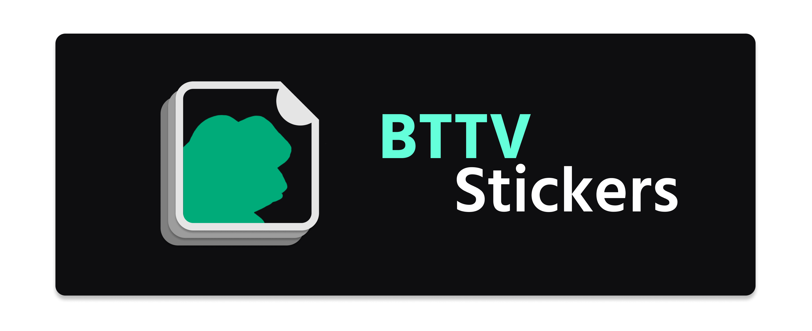
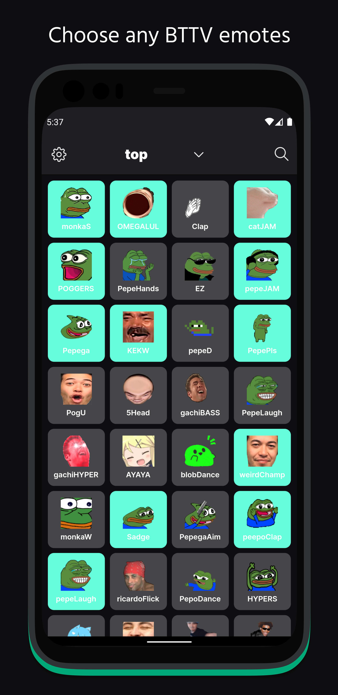
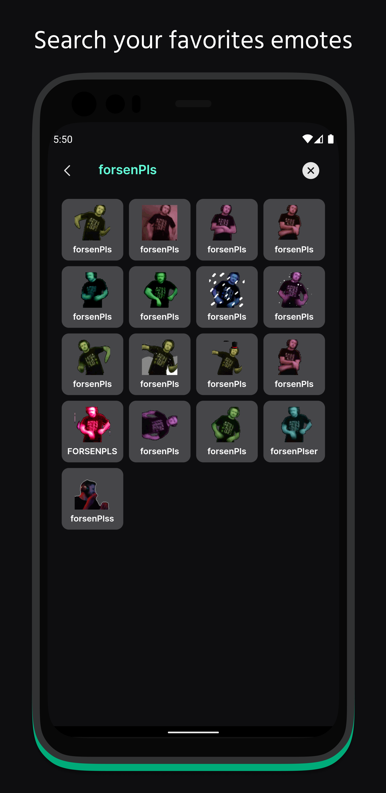
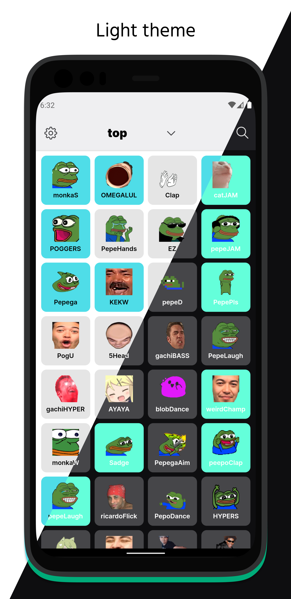

    
    

<h4 align="center">
Search and discover BTTV emotes to add to your keyboard stickers and use them anywhere
</h4>

## Features
- Sort emotes by top, trending, shared or global
- Search emotes by name
- Collect multiple emotes into a keyboard sticker pack
- Use the sticker pack to add the image of an emote anywhere that supports images (WhatsApp, Messenger, Telegram...)

## Screenshots

    <table>
        <tr>
            <td style="text-align: center">
                
            </td>
            <td style="text-align: center">
                
            </td>
            <td style="text-align: center">
                
            </td>
            <td style="text-align: center">
                
            </td>
        </tr>
    </table>

## Planned features
- Show the emotes currently added combined  
- Create multiple packs
- Being able to combine emotes to generate a single image with both emotes (EZ Clap)

## Contributing
Pull requests are welcome. For major changes, please open an issue first to discuss what you would like to change.

## License
[MIT](https://choosealicense.com/licenses/mit/)